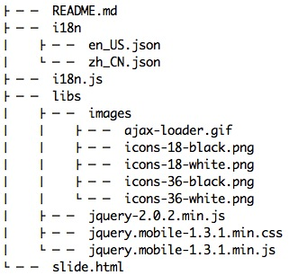

#INTRODUCTION

jqm-i18n is lightweight **i18n**（internationalization） plugin for jQuery mobile.It can detect the browser language and download the i18n resouces and apply them automatically.


#USAGE

to use this plugin, you should do as follows：

- add `<script src="i18n.js"></script>` to your HTML code
- prepare your i18n resouces,such as "en_US.json"、"zh_CN.json" etc under `i18n` folder. 



- write HTML code

``` html

<div data-role="page" id='main' data-theme="b">
    <div data-role="header" data-theme="b">
        <h1 data-i18n="main.header"></h1>
    </div>
    <div data-role="content">
		<a data-role="button" data-i18n="main.btn" id="btn"></a>
	</div>
</div>

<script src="libs/jquery-2.0.2.min.js"></script>
<script>
	$(document).bind("mobileinit", function(){
		$.mobile.i18nEnabled = true;
	});
</script>
<script src="libs/jquery.mobile-1.3.1.min.js"></script>
<script src="i18n.js"></script>
```

Pay attention to the attribute `data-i18n`, the plugin will parse it and get its value from the i18n resources.Take `en_US.json` for an exmaple:

``` js
// file en_US.json

{
     "title": "i18n Demo",
	 "main": {
		"header": "Slide Demo",
		"next": "Next Page",
		"footer": "I am Footer",
		"value": "2",
		"btn": "Javascript template content"
	 }

}
```

when set `<h1 data-i18n="main.header"></h1>`, the DOM will become `<h1 data-i18n="main.header">Slide Demo</h1>`

# TEST

You can [download](https://github.com/flyingzl/jqm-i18n/archive/master.zip) the plugin and open your webkit-kernel browser to visit `slide.html` to see the effect.

	
		

